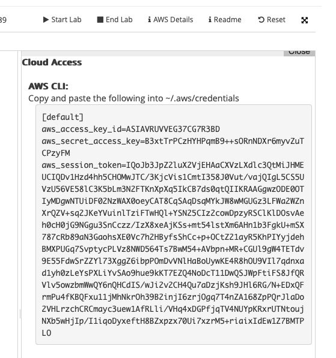

# Setting Up and Running Terraform with AWS Academy Account

This guide covers the steps to install Terraform, configure AWS credentials from your AWS Academy account, and run basic Terraform commands to create AWS resources.

---

## 1. Install Terraform on macOS

### Using Homebrew (recommended)

1. Open your terminal.
2. Run the following commands to install Terraform:

   ```bash
   brew tap hashicorp/tap
   brew install hashicorp/tap/terraform
   ```

3. Verify the installation by typing "terraform -v" in terminal

4. Log in to your AWS Academy Learner Lab.
5. Locate your AWS credentials — you will need: (These are only valid for the duration of your lab. Redo everytime you log in)
   - 
     (click on AWS details)
   - AWS_ACCESS_KEY_ID
   - AWS_SECRET_ACCESS_KEY
   - AWS_SESSION_TOKEN
   - AWS_DEFAULT_REGION (us-ease-1 for all of us)
6. Export these variables in your terminal session:

   - export AWS_ACCESS_KEY_ID="your-access-key-id"
   - export AWS_SECRET_ACCESS_KEY="your-secret-access-key"
   - export AWS_SESSION_TOKEN="your-session-token"
   - export AWS_DEFAULT_REGION="ap-southeast-2"
   - Note: These environment variables last only for the current terminal session. Export them each time you open a new terminal or automate with a script.

7. Do:
   - terraform init
   - terraform plan
   - terraform apply
